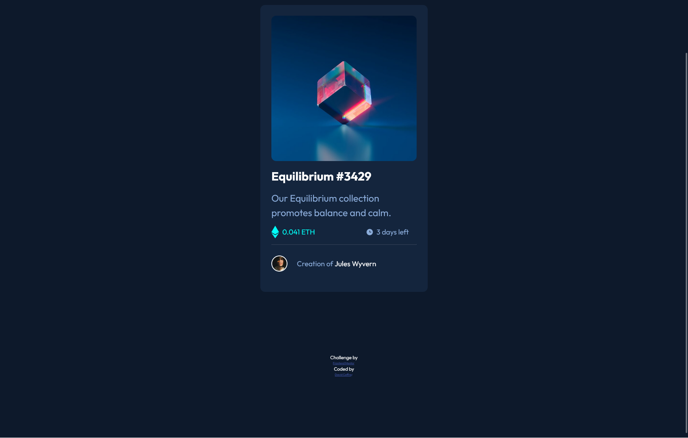

# Frontend Mentor - NFT preview card component solution

This is a solution to the [NFT preview card component challenge on Frontend Mentor](https://www.frontendmentor.io/challenges/nft-preview-card-component-SbdUL_w0U). Frontend Mentor challenges help you improve your coding skills by building realistic projects. 

## Table of contents

- [Overview](#overview)
  - [The challenge](#the-challenge)
  - [Screenshot](#screenshot)
  - [Links](#links)
- [My process](#my-process)
  - [Built with](#built-with)
  - [What I learned](#what-i-learned)
  - [Continued development](#continued-development)
- [Author](#author)
- [Acknowledgments](#acknowledgments)

**Note: Delete this note and update the table of contents based on what sections you keep.**

## Overview
This project was made with HTML5 and CSS3. The CSS included using flexbox, overlays, and transistions.

### The challenge

Users should be able to:

- View the optimal layout depending on their device's screen size
- See hover states for interactive elements

### Screenshot

### Links

- Solution URL: [Github Code](https://github.com/DavidCaffrey/nft-preview-card-component)
- Live Site URL: [Netlify Site](https://nft-card-caffrey.netlify.app/)

## My process
Followed Abdul Khalid from FEM advice on last project I made sure to only use semantic elements in html. I including a CSS reset by Andy Bell. I used custom css properties(variables) for 
the colors. 

### Built with

- Semantic HTML5 markup
- CSS custom properties
- Flexbox

### What I learned

I learnt the importance of semantic html, more figma usage and the use of overlays on hover state.

### Continued development

I realize I need more practice with css grid,figma,BEM,overlays

## Author

- Website - [My website](https://www.caffreymedia.com)
- Frontend Mentor - [David Caffrey](https://www.frontendmentor.io/profile/DavidCaffrey)

*
## Acknowledgments
Thanks to Abdul Khalid of FEM for his feedback.

